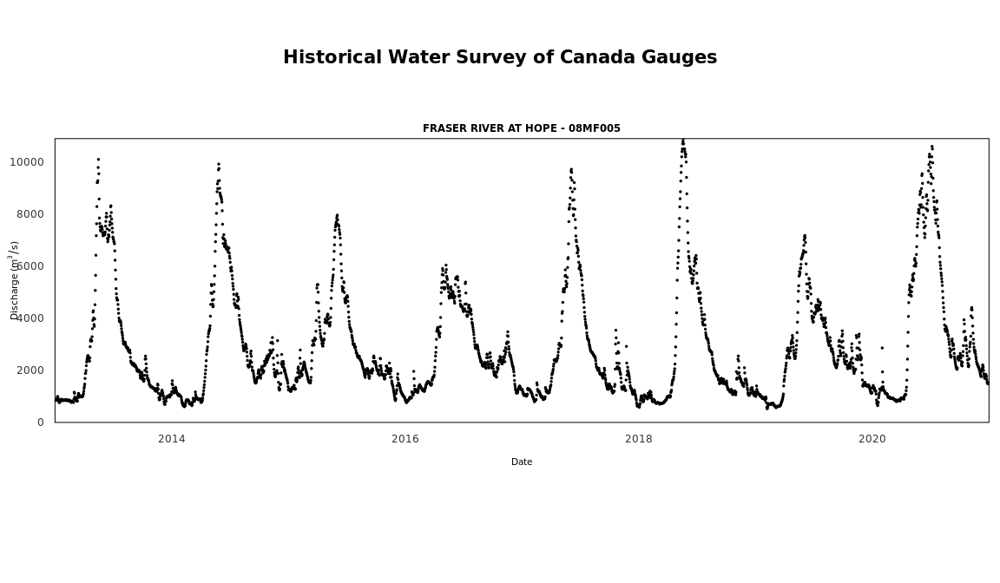

<!-- README.md is generated from README.Rmd. Please edit that file -->

# tidyhydat 

<!-- badges: start -->

<!-- badges: end -->

## What does `tidyhydat` do?

- Provides functions (`hy_*`) that access hydrometric data from the
  HYDAT database, a national archive of Canadian hydrometric data and
  return tidy data.
- Provides functions (`realtime_*`) that access Environment and Climate
  Change Canada’s real-time hydrometric data source.
- Provides functions (`search_*`) that can search through the
  approximately 7000 stations in the database and aid in generating
  station vectors
- Keep functions as simple as possible. For example, for daily flows,
  the `hy_daily_flows()` function queries the database, *tidies* the
  data and returns a [tibble](https://tibble.tidyverse.org/) of daily
  flows.

## Installation

You can install `tidyhydat` from CRAN:

    install.packages("tidyhydat")

To install the development version of the `tidyhydat` package, you can
install directly from the rOpenSci development server:

    install.packages("tidyhydat", repos = "https://dev.ropensci.org")

## Usage

More documentation on `tidyhydat` can found at the rOpenSci doc page:
<https://docs.ropensci.org/tidyhydat/>

When you install `tidyhydat`, several other packages will be installed
as well. One of those packages, `dplyr`, is useful for data
manipulations and is used regularly here. To use actually use `dplyr` in
a session you must explicitly load it. A helpful `dplyr` tutorial can be
found
[here](https://cran.r-project.org/package=dplyr/vignettes/dplyr.html).

    library(tidyhydat)
    library(dplyr)

### HYDAT download

To use many of the functions in the `tidyhydat` package you will need to
download a version of the HYDAT database, Environment and Climate Change
Canada’s database of historical hydrometric data then tell R where to
find the database. Conveniently `tidyhydat` does all this for you via:

    download_hydat()

This downloads (with your permission) the most recent version of HYDAT
and then saves it in a location on your computer where `tidyhydat`’s
function will look for it. Do be patient though as this can take a long
time! To see where HYDAT was saved you can run `hy_default_db()`. Now
that you have HYDAT downloaded and ready to go, you are all set to begin
looking at Canadian hydrometric data.

### Real-time

To download real-time data using the datamart we can use approximately
the same conventions discussed above. Using `realtime_dd()` we can
easily select specific stations by supplying a station of interest:

    realtime_dd(station_number = "08MF005")
    #>   Queried on: 2025-10-22 22:31:11.167549 (UTC)
    #>   Date range: 2025-09-22 to 2025-10-22 
    #> # A tibble: 17,598 × 8
    #>    STATION_NUMBER PROV_TERR_STATE_LOC Date                Parameter Value Grade
    #>    <chr>          <chr>               <dttm>              <chr>     <dbl> <chr>
    #>  1 08MF005        BC                  2025-09-22 08:00:00 Flow       1350 <NA> 
    #>  2 08MF005        BC                  2025-09-22 08:05:00 Flow       1360 <NA> 
    #>  3 08MF005        BC                  2025-09-22 08:10:00 Flow       1350 <NA> 
    #>  4 08MF005        BC                  2025-09-22 08:15:00 Flow       1350 <NA> 
    #>  5 08MF005        BC                  2025-09-22 08:20:00 Flow       1350 <NA> 
    #>  6 08MF005        BC                  2025-09-22 08:25:00 Flow       1360 <NA> 
    #>  7 08MF005        BC                  2025-09-22 08:30:00 Flow       1350 <NA> 
    #>  8 08MF005        BC                  2025-09-22 08:35:00 Flow       1360 <NA> 
    #>  9 08MF005        BC                  2025-09-22 08:40:00 Flow       1360 <NA> 
    #> 10 08MF005        BC                  2025-09-22 08:45:00 Flow       1350 <NA> 
    #> # ℹ 17,588 more rows
    #> # ℹ 2 more variables: Symbol <chr>, Code <chr>

Or we can use `realtime_ws`:

    realtime_ws(
      station_number = "08MF005",
      parameters = c(46, 5), ## see param_id for a list of codes
      start_date = Sys.Date() - 14,
      end_date = Sys.Date()
    )
    #> All station successfully retrieved
    #> All parameters successfully retrieved
    #> # A tibble: 4,658 × 12
    #>    STATION_NUMBER Date                Name_En  Value Unit  Grade Symbol Approval
    #>    <chr>          <dttm>              <chr>    <dbl> <chr> <lgl> <chr>  <chr>   
    #>  1 08MF005        2025-10-08 00:00:00 Water t…  13.8 °C    NA    <NA>   Provisi…
    #>  2 08MF005        2025-10-08 01:00:00 Water t…  13.8 °C    NA    <NA>   Provisi…
    #>  3 08MF005        2025-10-08 02:00:00 Water t…  13.8 °C    NA    <NA>   Provisi…
    #>  4 08MF005        2025-10-08 03:00:00 Water t…  13.8 °C    NA    <NA>   Provisi…
    #>  5 08MF005        2025-10-08 04:00:00 Water t…  13.8 °C    NA    <NA>   Provisi…
    #>  6 08MF005        2025-10-08 05:00:00 Water t…  13.8 °C    NA    <NA>   Provisi…
    #>  7 08MF005        2025-10-08 06:00:00 Water t…  13.8 °C    NA    <NA>   Provisi…
    #>  8 08MF005        2025-10-08 07:00:00 Water t…  13.8 °C    NA    <NA>   Provisi…
    #>  9 08MF005        2025-10-08 08:00:00 Water t…  13.8 °C    NA    <NA>   Provisi…
    #> 10 08MF005        2025-10-08 09:00:00 Water t…  13.8 °C    NA    <NA>   Provisi…
    #> # ℹ 4,648 more rows
    #> # ℹ 4 more variables: Parameter <dbl>, Code <chr>, Qualifier <chr>,
    #> #   Qualifiers <lgl>

## Compare realtime\_ws and realtime\_dd

`tidyhydat` provides two methods to download realtime data.
`realtime_dd()` provides a function to import .csv files from
[here](https://dd.weather.gc.ca/today/hydrometric/). `realtime_ws()` is
an client for a web service hosted by ECCC. `realtime_ws()` has several
difference to `realtime_dd()`. These include:

- *Speed*: The `realtime_ws()` is much faster for larger queries
  (i.e. many stations). For single station queries to `realtime_dd()` is
  more appropriate.
- *Length of record*: `realtime_ws()` records goes back further in time.
- *Type of parameters*: `realtime_dd()` are restricted to river flow
  (either flow and level) data. In contrast `realtime_ws()` can download
  several different parameters depending on what is available for that
  station. See `data("param_id")` for a list and explanation of the
  parameters.
- *Date/Time filtering*: `realtime_ws()` provides argument to select a
  date range. Selecting a data range with `realtime_dd()` is not
  possible until after all files have been downloaded.

### Plotting

Plot methods are also provided to quickly visualize realtime data:

    realtime_ex <- realtime_dd(station_number = "08MF005")

    plot(realtime_ex)

and also historical data:

    hy_ex <- hy_daily_flows(station_number = "08MF005", start_date = "2013-01-01")

    plot(hy_ex)

## Getting Help or Reporting an Issue

To report bugs/issues/feature requests, please file an
[issue](https://github.com/ropensci/tidyhydat/issues/).

These are very welcome!

## How to Contribute

If you would like to contribute to the package, please see our
[CONTRIBUTING](https://github.com/ropensci/tidyhydat/blob/master/CONTRIBUTING.md)
guidelines.

Please note that this project is released with a [Contributor Code of
Conduct](https://github.com/ropensci/tidyhydat/blob/master/CODE_OF_CONDUCT.md).
By participating in this project you agree to abide by its terms.

## Citation

Get citation information for `tidyhydat` in R by running:

    To cite package 'tidyhydat' in publications use:

      Albers S (2017). "tidyhydat: Extract and Tidy Canadian Hydrometric
      Data." _The Journal of Open Source Software_, *2*(20).
      doi:10.21105/joss.00511 <https://doi.org/10.21105/joss.00511>,
      <http://dx.doi.org/10.21105/joss.00511>.

    A BibTeX entry for LaTeX users is

      @Article{,
        title = {tidyhydat: Extract and Tidy Canadian Hydrometric Data},
        author = {Sam Albers},
        doi = {10.21105/joss.00511},
        url = {http://dx.doi.org/10.21105/joss.00511},
        year = {2017},
        publisher = {The Open Journal},
        volume = {2},
        number = {20},
        journal = {The Journal of Open Source Software},
      }

## License

Copyright 2017 Province of British Columbia

Licensed under the Apache License, Version 2.0 (the “License”); you may
not use this file except in compliance with the License. You may obtain
a copy of the License at

<https://www.apache.org/licenses/LICENSE-2.0>

Unless required by applicable law or agreed to in writing, software
distributed under the License is distributed on an “AS IS” BASIS,
WITHOUT WARRANTIES OR CONDITIONS OF ANY KIND, either express or implied.
See the License for the specific language governing permissions and
limitations under the License.
