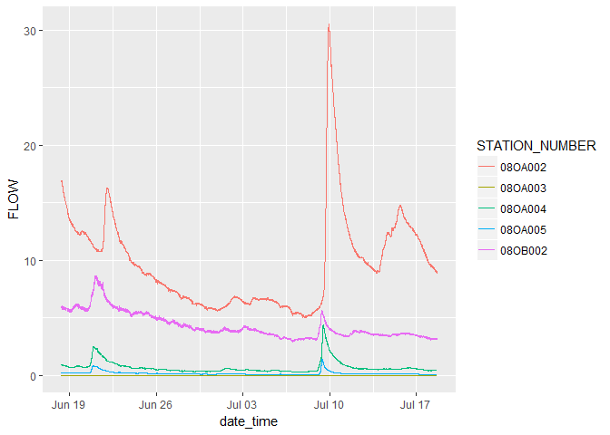

<a rel="Exploration" href="https://github.com/BCDevExchange/docs/blob/master/discussion/projectstates.md"></a>

<!-- README.md is generated from README.Rmd. Please edit that file -->
tidyhydat
=========

Here is a list of what tidyhydat does: - Perform a number of common queries on the HYDAT database and returns a tibble - Maintains the same column names as the database itself - Can select one, two... x stations - Keep functions are low-level as possible. For example, for daily flows, the function should query the database then format the dates and that is it. - An additional auxiliary feature outside the HYDAT database is the downloading of realtime data. This functionality is provided by `download_realtime()` and `download_network()`.

Installation
------------

To install the tidyhydat package, you need to install the devtools package then the tidyhydat package

``` r
install.packages("devtools")
devtools::install_github("bcgov/tidyhydat")
```

Then to load the package you need to use the library command. When you install tidyhydat, several other packages will be installed as well. One of those packages, `dplyr`, is useful for data manipulations and is used regularly here. Even though `dplyr` is installed alongside `tidyhydat`, you must still load it explicitly.

``` r
library(tidyhydat)
library(dplyr)
#> 
#> Attaching package: 'dplyr'
#> The following objects are masked from 'package:stats':
#> 
#>     filter, lag
#> The following objects are masked from 'package:base':
#> 
#>     intersect, setdiff, setequal, union
```

HYDAT download
--------------

To use most of the `tidyhydat` package you will need the most recent version of the HYDAT database. The sqlite3 version can be downloaded here:

-   <http://collaboration.cmc.ec.gc.ca/cmc/hydrometrics/www/>

You will need to download that file, unzip it and put it somewhere on local storage. The path to the sqlite3 must be specified within each function that uses HYDAT.

Example
-------

This is a basic example of `tidyhydat` usage. All functions that interact with HYDAT are capitalized (e.g. STATIONS). These functions follow a common argument structure which can be illustrated with the `DLY_FLOWS()` function. If you would like to extract only station `08LA001` you must supply the `STATION_NUMBER` and the `PROV_TERR_STATE_LOC` arguments:

``` r
DLY_FLOWS(STATION_NUMBER = "08LA001", PROV_TERR_STATE_LOC = "BC")
#> Applying predicate on the first 100 rows
#> # A tibble: 28,794 x 3
#> # Groups:   STATION_NUMBER [1]
#>    STATION_NUMBER  FLOW       Date
#>             <chr> <dbl>     <date>
#>  1        08LA001   144 1914-01-01
#>  2        08LA001   150 1914-02-01
#>  3        08LA001   166 1914-03-01
#>  4        08LA001   160 1914-04-01
#>  5        08LA001   173 1914-05-01
#>  6        08LA001   411 1914-06-01
#>  7        08LA001   589 1914-07-01
#>  8        08LA001   374 1914-08-01
#>  9        08LA001   199 1914-09-01
#> 10        08LA001   289 1914-10-01
#> # ... with 28,784 more rows
```

If you would like to query the database for two or more stations you would supply this command:

``` r
DLY_FLOWS(STATION_NUMBER = c("08LA001","08NL071"), PROV_TERR_STATE_LOC = "BC")
#> Applying predicate on the first 100 rows
#> # A tibble: 42,522 x 3
#> # Groups:   STATION_NUMBER [2]
#>    STATION_NUMBER  FLOW       Date
#>             <chr> <dbl>     <date>
#>  1        08LA001   144 1914-01-01
#>  2        08LA001   150 1914-02-01
#>  3        08LA001   166 1914-03-01
#>  4        08LA001   160 1914-04-01
#>  5        08LA001   173 1914-05-01
#>  6        08LA001   411 1914-06-01
#>  7        08LA001   589 1914-07-01
#>  8        08LA001   374 1914-08-01
#>  9        08LA001   199 1914-09-01
#> 10        08LA001   289 1914-10-01
#> # ... with 42,512 more rows
```

If instead you would like to download ALL stations from a jurisdictions, you can use the "ALL" argument for `STATION_NUMBER`:

``` r
DLY_FLOWS(STATION_NUMBER = "ALL", PROV_TERR_STATE_LOC = "PE")
#> Applying predicate on the first 100 rows
#> # A tibble: 185,763 x 3
#> # Groups:   STATION_NUMBER [40]
#>    STATION_NUMBER  FLOW       Date
#>             <chr> <dbl>     <date>
#>  1        01CA001    NA 1919-08-01
#>  2        01CA001 0.042 1919-09-01
#>  3        01CA001 0.085 1919-10-01
#>  4        01CA001 0.255 1919-11-01
#>  5        01CA001 1.130 1919-12-01
#>  6        01CA001 0.085 1920-01-01
#>  7        01CA001 0.057 1920-02-01
#>  8        01CA001 0.085 1920-03-01
#>  9        01CA001 4.160 1920-04-01
#> 10        01CA001 2.890 1920-05-01
#> # ... with 185,753 more rows
```

Basin realtime data acquisition usage
-------------------------------------

To download realtime data we can use approximately the same conventions discussed above. All non-HYDAT functions are in lower case. Using `download_realtime()` we can easily select specific stations by supplying a station of interest. Note that again, we need to supply both the station and the province that we are interested in:

``` r
download_realtime(STATION_NUMBER = "08LG006", PROV_TERR_STATE_LOC = "BC")
#> # A tibble: 8,670 x 10
#>    STATION_NUMBER           date_time LEVEL LEVEL_GRADE LEVEL_SYMBOL
#>             <chr>              <dttm> <dbl>       <chr>        <chr>
#>  1        08LG006 2017-06-18 08:00:00 2.192        <NA>         <NA>
#>  2        08LG006 2017-06-18 08:05:00 2.192        <NA>         <NA>
#>  3        08LG006 2017-06-18 08:10:00 2.192        <NA>         <NA>
#>  4        08LG006 2017-06-18 08:15:00 2.192        <NA>         <NA>
#>  5        08LG006 2017-06-18 08:20:00 2.191        <NA>         <NA>
#>  6        08LG006 2017-06-18 08:25:00 2.191        <NA>         <NA>
#>  7        08LG006 2017-06-18 08:30:00 2.191        <NA>         <NA>
#>  8        08LG006 2017-06-18 08:35:00 2.191        <NA>         <NA>
#>  9        08LG006 2017-06-18 08:40:00 2.191        <NA>         <NA>
#> 10        08LG006 2017-06-18 08:45:00 2.191        <NA>         <NA>
#> # ... with 8,660 more rows, and 5 more variables: LEVEL_CODE <int>,
#> #   FLOW <dbl>, FLOW_GRADE <chr>, FLOW_SYMBOL <chr>, FLOW_CODE <int>
```

Downloading by jurisdiction
---------------------------

We can use the `download_network()` functionality to get a vector of stations by jurisdiction. For example, we can choose all the stations in Prince Edward Island using the following:

``` r
download_realtime(STATION_NUMBER = "ALL", PROV_TERR_STATE_LOC = "PE")
#> # A tibble: 31,019 x 10
#>    STATION_NUMBER           date_time LEVEL LEVEL_GRADE LEVEL_SYMBOL
#>             <chr>              <dttm> <dbl>       <chr>        <chr>
#>  1        01CD005 2017-06-18 04:00:00 0.616        <NA>         <NA>
#>  2        01CD005 2017-06-18 04:15:00 0.617        <NA>         <NA>
#>  3        01CD005 2017-06-18 04:30:00 0.617        <NA>         <NA>
#>  4        01CD005 2017-06-18 04:45:00 0.618        <NA>         <NA>
#>  5        01CD005 2017-06-18 05:00:00 0.618        <NA>         <NA>
#>  6        01CD005 2017-06-18 05:15:00 0.619        <NA>         <NA>
#>  7        01CD005 2017-06-18 05:30:00 0.619        <NA>         <NA>
#>  8        01CD005 2017-06-18 05:45:00 0.619        <NA>         <NA>
#>  9        01CD005 2017-06-18 06:00:00 0.619        <NA>         <NA>
#> 10        01CD005 2017-06-18 06:15:00 0.620        <NA>         <NA>
#> # ... with 31,009 more rows, and 5 more variables: LEVEL_CODE <int>,
#> #   FLOW <dbl>, FLOW_GRADE <chr>, FLOW_SYMBOL <chr>, FLOW_CODE <int>
```

### On the distinction between STATIONS() and download\_network()

`STATIONS()` and `download_network()` perform similar tasks albeit on different data sources. `STATIONS()` extracts directly from the HYDAT sqlite3 database. In addition to realtime stations, `STATIONS()` outputs discontinued and non-realtime stations:

``` r
STATIONS(STATION_NUMBER = "ALL", PROV_TERR_STATE_LOC = "PE")
#> # A tibble: 41 x 15
#>    STATION_NUMBER                      STATION_NAME PROV_TERR_STATE_LOC
#>             <chr>                             <chr>               <chr>
#>  1        01CA001      CARRUTHERS BROOK NEAR HOWLAN                  PE
#>  2        01CA002      TROUT RIVER NEAR TYNE VALLEY                  PE
#>  3        01CA003 CARRUTHERS BROOK NEAR ST. ANTHONY                  PE
#>  4        01CA004        SMELT CREEK NEAR ELLERSLIE                  PE
#>  5        01CA005  MIMINEGASH RIVER AT ST. LAWRENCE                  PE
#>  6        01CB001         DUNK RIVER AT ROGERS MILL                  PE
#>  7        01CB002           DUNK RIVER AT WALL ROAD                  PE
#>  8        01CB003          PLAT RIVER AT SHERBROOKE                  PE
#>  9        01CB004   WILMOT RIVER NEAR WILMOT VALLEY                  PE
#> 10        01CB005        NORTH BROOK NEAR WALL ROAD                  PE
#> # ... with 31 more rows, and 12 more variables: REGIONAL_OFFICE_ID <chr>,
#> #   HYD_STATUS <chr>, SED_STATUS <chr>, LATITUDE <dbl>, LONGITUDE <dbl>,
#> #   DRAINAGE_AREA_GROSS <dbl>, DRAINAGE_AREA_EFFECT <dbl>, RHBN <int>,
#> #   REAL_TIME <int>, CONTRIBUTOR_ID <int>, OPERATOR_ID <int>,
#> #   DATUM_ID <int>
```

This is contrast to `download_network()` which downloads all realtime stations. Though this is not always the case, it is best to use `download_network()` when dealing with realtime data and `STATIONS()` when interacting with HYDAT.

Example with spatial data
-------------------------

The `download_realtime()` functions allows us to directly query the Environment Canada and Climate Change datamart selecting by station. If we wanted to look at all the realtime stations in a particular hydrologic zone, we could easily do this using the `dplyr`,`sf` and `bcmaps` packages. To install those packages use these commands:

``` r
devtools::install_github("bcgov/bcmaps")
install.packages("sf")
```

And then load these packages. `tidyhydat` and `dplyr` is already loaded above.

``` r
library(bcmaps)
#> Loading required package: sp
#> Warning: package 'sp' was built under R version 3.4.1
library(sf)
#> Linking to GEOS 3.5.0, GDAL 2.1.1, proj.4 4.9.3
```

Now to return the question. BC is divided into hydrologic zones. If use the hydrozones layer in `bcmaps` and convert it to `sf` format, determining which stations reside in which hydrologic zone is trivial. Using `st_join` allows to ask which hydrometric stations in the realtime network (called by `download_network`) are in which hydrologic zones. If we are interested in all realtime stations in the QUEEN CHARLOTTE ISLANDS hydrologic zone, we can generate that list by filtering by the relevant hydrologic zone:

``` r
## Convert to sf format
hydrozones_sf <- st_as_sf(bcmaps::hydrozones) %>%
  select(HYDZN_NAME)


qci_stations <- download_network(PROV_TERR_STATE_LOC = "BC") %>%
  st_as_sf(., coords = c("LONGITUDE", "LATITUDE"), 
              crs = 4326, 
              agr = "constant") %>%
  st_transform(crs = 3005) %>%
  st_join(.,hydrozones_sf) %>%
  filter(HYDZN_NAME == "QUEEN CHARLOTTE ISLANDS") %>%
  pull(STATION_NUMBER)

qci_stations
#> [1] "08OA002" "08OA003" "08OA004" "08OA005" "08OB002"
```

Now that vector (`qci_stations`) is useful to select which stations we are interested in.

``` r
qci_realtime <- download_realtime(STATION_NUMBER = qci_stations, PROV_TERR_STATE_LOC = "BC")
```

Then using `ggplot2` we could plot these results to have look at the data

``` r
library(ggplot2)

ggplot(qci_realtime, aes(x = date_time, y = FLOW)) +
  geom_line(aes(colour = STATION_NUMBER))
```



Project Status
--------------

This package is under continual development.

Getting Help or Reporting an Issue
----------------------------------

To report bugs/issues/feature requests, please file an [issue](https://github.com/bcgov/tidyhydat/issues/).

How to Contribute
-----------------

If you would like to contribute to the package, please see our [CONTRIBUTING](CONTRIBUTING.md) guidelines.

Please note that this project is released with a [Contributor Code of Conduct](CODE_OF_CONDUCT.md). By participating in this project you agree to abide by its terms.

License
-------

    Copyright 2015 Province of British Columbia

    Licensed under the Apache License, Version 2.0 (the "License");
    you may not use this file except in compliance with the License.
    You may obtain a copy of the License at 

       http://www.apache.org/licenses/LICENSE-2.0

    Unless required by applicable law or agreed to in writing, software
    distributed under the License is distributed on an "AS IS" BASIS,
    WITHOUT WARRANTIES OR CONDITIONS OF ANY KIND, either express or implied.
    See the License for the specific language governing permissions and
    limitations under the License.
