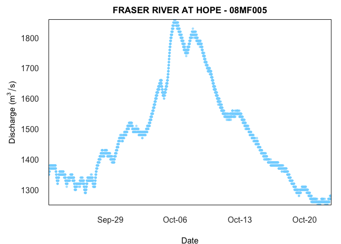

<!-- README.md is generated from README.Rmd. Please edit that file -->

# tidyhydat 

<!-- badges: start -->

<!-- badges: end -->

## Project Status

This package is maintained by the Data Science Partnerships Program in
the [British Columbia Ministry of Citizens’
Services](https://www2.gov.bc.ca/gov/content/governments/organizational-structure/ministries-organizations/ministries/citizens-services).

## What does `tidyhydat` do?

-   Provides functions (`hy_*`) that access hydrometric data from the
    HYDAT database, a national archive of Canadian hydrometric data and
    return tidy data.
-   Provides functions (`realtime_*`) that access Environment and
    Climate Change Canada’s real-time hydrometric data source.
-   Provides functions (`search_*`) that can search through the
    approximately 7000 stations in the database and aid in generating
    station vectors
-   Keep functions as simple as possible. For example, for daily flows,
    the `hy_daily_flows()` function queries the database, *tidies* the
    data and returns a [tibble](https://tibble.tidyverse.org/) of daily
    flows.

## Installation

You can install `tidyhydat` from CRAN:

    install.packages("tidyhydat")

To install the development version of the `tidyhydat` package, you can
install directly from the rOpenSci development server:

    install.packages("tidyhydat", repos = "https://dev.ropensci.org")

## Usage

More documentation on `tidyhydat` can found at the rOpenSci doc page:
<https://docs.ropensci.org/tidyhydat/>

When you install `tidyhydat`, several other packages will be installed
as well. One of those packages, `dplyr`, is useful for data
manipulations and is used regularly here. To use actually use `dplyr` in
a session you must explicitly load it. A helpful `dplyr` tutorial can be
found
[here](https://cran.r-project.org/package=dplyr/vignettes/dplyr.html).

    library(tidyhydat)
    library(dplyr)

### HYDAT download

To use many of the functions in the `tidyhydat` package you will need to
download a version of the HYDAT database, Environment and Climate Change
Canada’s database of historical hydrometric data then tell R where to
find the database. Conveniently `tidyhydat` does all this for you via:

    download_hydat()

This downloads (with your permission) the most recent version of HYDAT
and then saves it in a location on your computer where `tidyhydat`’s
function will look for it. Do be patient though as this can take a long
time! To see where HYDAT was saved you can run `hy_default_db()`. Now
that you have HYDAT downloaded and ready to go, you are all set to begin
looking at Canadian hydrometric data.

### Real-time

To download real-time data using the datamart we can use approximately
the same conventions discussed above. Using `realtime_dd()` we can
easily select specific stations by supplying a station of interest:

    realtime_dd(station_number = "08MF005")
    #>   Queried on: 2022-03-16 22:48:40 (UTC)
    #>   Date range: 2022-02-14 to 2022-03-16 
    #> # A tibble: 17,608 x 8
    #>    STATION_NUMBER PROV_TERR_STATE_LOC Date                Parameter Value Grade
    #>    <chr>          <chr>               <dttm>              <chr>     <dbl> <chr>
    #>  1 08MF005        BC                  2022-02-14 08:00:00 Flow       1080 <NA> 
    #>  2 08MF005        BC                  2022-02-14 08:05:00 Flow       1080 <NA> 
    #>  3 08MF005        BC                  2022-02-14 08:10:00 Flow       1070 <NA> 
    #>  4 08MF005        BC                  2022-02-14 08:15:00 Flow       1070 <NA> 
    #>  5 08MF005        BC                  2022-02-14 08:20:00 Flow       1070 <NA> 
    #>  6 08MF005        BC                  2022-02-14 08:25:00 Flow       1070 <NA> 
    #>  7 08MF005        BC                  2022-02-14 08:30:00 Flow       1070 <NA> 
    #>  8 08MF005        BC                  2022-02-14 08:35:00 Flow       1080 <NA> 
    #>  9 08MF005        BC                  2022-02-14 08:40:00 Flow       1070 <NA> 
    #> 10 08MF005        BC                  2022-02-14 08:45:00 Flow       1070 <NA> 
    #> # ... with 17,598 more rows, and 2 more variables: Symbol <chr>, Code <chr>

### Plotting

Plot methods are also provided to quickly visualize realtime data:

    realtime_ex <- realtime_dd(station_number = "08MF005")

    plot(realtime_ex)

and also historical data:

    hy_ex <- hy_daily_flows(station_number = "08MF005", start_date = "2013-01-01")

    plot(hy_ex)

## Getting Help or Reporting an Issue

To report bugs/issues/feature requests, please file an
[issue](https://github.com/ropensci/tidyhydat/issues/).

These are very welcome!

## How to Contribute

If you would like to contribute to the package, please see our
[CONTRIBUTING](https://github.com/ropensci/tidyhydat/blob/master/CONTRIBUTING.md)
guidelines.

Please note that this project is released with a [Contributor Code of
Conduct](https://github.com/ropensci/tidyhydat/blob/master/CODE_OF_CONDUCT.md).
By participating in this project you agree to abide by its terms.

## Citation

Get citation information for `tidyhydat` in R by running:

    Albers S (2017). "tidyhydat: Extract and Tidy Canadian Hydrometric
    Data." _The Journal of Open Source Software_, *2*(20). doi:
    10.21105/joss.00511 (URL: https://doi.org/10.21105/joss.00511), <URL:
    http://dx.doi.org/10.21105/joss.00511>.

    A BibTeX entry for LaTeX users is

      @Article{,
        title = {tidyhydat: Extract and Tidy Canadian Hydrometric Data},
        author = {Sam Albers},
        doi = {10.21105/joss.00511},
        url = {http://dx.doi.org/10.21105/joss.00511},
        year = {2017},
        publisher = {The Open Journal},
        volume = {2},
        number = {20},
        journal = {The Journal of Open Source Software},
      }

## License

Copyright 2017 Province of British Columbia

Licensed under the Apache License, Version 2.0 (the “License”); you may
not use this file except in compliance with the License. You may obtain
a copy of the License at

<https://www.apache.org/licenses/LICENSE-2.0>

Unless required by applicable law or agreed to in writing, software
distributed under the License is distributed on an “AS IS” BASIS,
WITHOUT WARRANTIES OR CONDITIONS OF ANY KIND, either express or implied.
See the License for the specific language governing permissions and
limitations under the License.
