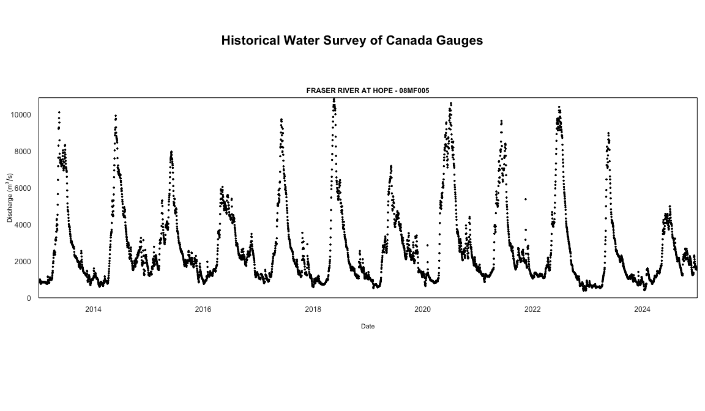

<!-- README.md is generated from README.Rmd. Please edit that file -->

# tidyhydat 

[](https://github.com/BCDevExchange/assets/blob/master/README.md)
[](https://opensource.org/licenses/Apache-2.0)
[](https://travis-ci.org/ropensci/tidyhydat)
[](https://codecov.io/github/ropensci/tidyhydat?branch=master)

[](https://cran.r-project.org/package=tidyhydat)
[](https://CRAN.R-project.org/package=tidyhydat)
[](https://cran.rstudio.com/web/checks/check_results_tidyhydat.html)

[](https://github.com/ropensci/onboarding/issues/152)
[](https://doi.org/10.21105/joss.00511)
[](https://zenodo.org/badge/latestdoi/100978874)

## Project Status

This package is maintained by the Knowledge Management Branch of the
[British Columbia Ministry of Environment and Climate Change
Strategy](https://www2.gov.bc.ca/gov/content/governments/organizational-structure/ministries-organizations/ministries/environment-climate-change).

## What does `tidyhydat` do?

  - Provides functions (`hy_*`) that access hydrometric data from the
    HYDAT database, a national archive of Canadian hydrometric data and
    return tidy data.
  - Provides functions (`realtime_*`) that access Environment and
    Climate Change Canada’s real-time hydrometric data source.
  - Provides functions (`search_*`) that can search through the
    approximately 7000 stations in the database and aid in generating
    station vectors
  - Keep functions as simple as possible. For example, for daily flows,
    the `hy_daily_flows()` function queries the database, *tidies* the
    data and returns a [tibble](http://tibble.tidyverse.org/) of daily
    flows.

## Installation

You can install `tidyhydat` from CRAN:

``` r
install.packages("tidyhydat")
```

To install the development version of the `tidyhydat` package, you need
to install the `remotes` package then the `tidyhydat` package

``` r
if(!requireNamespace("remotes")) install.packages("remotes")
remotes::install_github("ropensci/tidyhydat")
```

## Usage

A more thorough vignette can be found on the `tidyhydat` [CRAN
page](https://cran.r-project.org/web/packages/tidyhydat/vignettes/tidyhydat_an_introduction.html).

When you install `tidyhydat`, several other packages will be installed
as well. One of those packages, `dplyr`, is useful for data
manipulations and is used regularly here. To use `dplyr`, it is required
to be loaded by itself. A helpful `dplyr` tutorial can be found
[here](https://cran.r-project.org/web/packages/dplyr/vignettes/dplyr.html).

``` r
library(tidyhydat)
library(dplyr)
```

### HYDAT download

To use many of the functions in the `tidyhydat` package you will need to
download a version of the HYDAT database, Environment and Climate Change
Canada’s database of historical hydrometric data then tell R where to
find the database. Conveniently `tidyhydat` does all this for you via:

``` r
download_hydat()
```

This downloads (with your permission) the most recent version of HYDAT
and then saves it in a location on your computer where `tidyhydat`’s
function will look for it. Do be patient though as this takes a long
time\! To see where HYDAT was saved you can run `hy_dir()`. Now that you
have HYDAT downloaded and ready to go, you are all set to begin looking
at Canadian hydrometric data.

Most functions in `tidyhydat` follow a common argument structure. We
will use the `hy_daily_flows()` function for the following examples
though the same approach applies to most functions in the package (See
`help(package = "tidyhydat")` for a list of exported objects). Much of
the functionality of `tidyhydat` originates with the choice of
hydrometric stations that you are interested in. A user will often find
themselves creating vectors of station numbers. There are several ways
to do this.

The simplest case is if you would like to extract only station. You can
supply this directly to the `station_number` argument:

``` r
hy_daily_flows(station_number = "08LA001")
#>   Queried from version of HYDAT released on 2019-07-17
#>    Observations:                      29,890
#>    Measurement flags:                 5,922
#>    Parameter(s):                      Flow
#>    Date range:                        1914-01-01 to 2017-12-31 
#>    Station(s) returned:               1
#>    Stations requested but not returned: 
#>     All stations returned.
#> # A tibble: 29,890 x 5
#>    STATION_NUMBER Date       Parameter Value Symbol
#>    <chr>          <date>     <chr>     <dbl> <chr> 
#>  1 08LA001        1914-01-01 Flow        144 <NA>  
#>  2 08LA001        1914-01-02 Flow        144 <NA>  
#>  3 08LA001        1914-01-03 Flow        144 <NA>  
#>  4 08LA001        1914-01-04 Flow        140 <NA>  
#>  5 08LA001        1914-01-05 Flow        140 <NA>  
#>  6 08LA001        1914-01-06 Flow        136 <NA>  
#>  7 08LA001        1914-01-07 Flow        136 <NA>  
#>  8 08LA001        1914-01-08 Flow        140 <NA>  
#>  9 08LA001        1914-01-09 Flow        140 <NA>  
#> 10 08LA001        1914-01-10 Flow        140 <NA>  
#> # ... with 29,880 more rows
```

Another method is to use `hy_stations()` to generate your vector which
is then given the `station_number` argument. For example, we could take
a subset for only those active stations within Prince Edward Island
(Province code: `PE`) and then create vector which is passed to the
multi-parameter function `hy_daily()`. This function queries the flow,
level, sediment load and suspended sediment concentration tables and
combines them (if present) into one dataframe:

``` r
PEI_stns <- hy_stations() %>%
  filter(HYD_STATUS == "ACTIVE") %>%
  filter(PROV_TERR_STATE_LOC == "PE") %>%
  pull_station_number()

PEI_stns
#> [1] "01CA003" "01CB002" "01CB004" "01CC002" "01CC005" "01CC010" "01CC011"
#> [8] "01CD005"

hy_daily(station_number = PEI_stns)
#>   Queried from version of HYDAT released on 2019-07-17
#>    Observations:                      138,085
#>    Measurement flags:                 20,521
#>    Parameter(s):                      Flow/Level/Load/Suscon
#>    Date range:                        1961-08-01 to 2017-12-31 
#>    Station(s) returned:               8
#>    Stations requested but not returned: 
#>     All stations returned.
#> # A tibble: 138,085 x 5
#>    STATION_NUMBER Date       Parameter Value Symbol
#>    <chr>          <date>     <chr>     <dbl> <chr> 
#>  1 01CA003        1961-08-01 Flow         NA <NA>  
#>  2 01CA003        1961-08-02 Flow         NA <NA>  
#>  3 01CA003        1961-08-03 Flow         NA <NA>  
#>  4 01CA003        1961-08-04 Flow         NA <NA>  
#>  5 01CA003        1961-08-05 Flow         NA <NA>  
#>  6 01CA003        1961-08-06 Flow         NA <NA>  
#>  7 01CA003        1961-08-07 Flow         NA <NA>  
#>  8 01CA003        1961-08-08 Flow         NA <NA>  
#>  9 01CA003        1961-08-09 Flow         NA <NA>  
#> 10 01CA003        1961-08-10 Flow         NA <NA>  
#> # ... with 138,075 more rows
```

We can also merge our station choice and data extraction into one
unified pipe which accomplishes a single goal. For example, if for some
reason we wanted all the stations in Canada that had the name “Canada”
in them we could unify those selection and data extraction processes
into a single pipe:

``` r
search_stn_name("canada") %>%
  pull_station_number() %>%
  hy_daily_flows()
#>   Queried from version of HYDAT released on 2019-07-17
#>    Observations:                      80,455
#>    Measurement flags:                 24,036
#>    Parameter(s):                      Flow
#>    Date range:                        1918-08-01 to 2019-05-31 
#>    Station(s) returned:               7
#>    Stations requested but not returned: 
#>     All stations returned.
#> # A tibble: 80,455 x 5
#>    STATION_NUMBER Date       Parameter Value Symbol
#>    <chr>          <date>     <chr>     <dbl> <chr> 
#>  1 01AK001        1918-08-01 Flow      NA    <NA>  
#>  2 01AK001        1918-08-02 Flow      NA    <NA>  
#>  3 01AK001        1918-08-03 Flow      NA    <NA>  
#>  4 01AK001        1918-08-04 Flow      NA    <NA>  
#>  5 01AK001        1918-08-05 Flow      NA    <NA>  
#>  6 01AK001        1918-08-06 Flow      NA    <NA>  
#>  7 01AK001        1918-08-07 Flow       1.78 <NA>  
#>  8 01AK001        1918-08-08 Flow       1.78 <NA>  
#>  9 01AK001        1918-08-09 Flow       1.5  <NA>  
#> 10 01AK001        1918-08-10 Flow       1.78 <NA>  
#> # ... with 80,445 more rows
```

These example illustrate a few ways that an vector can be generated and
supplied to functions within `tidyhydat`.

### Real-time

To download real-time data using the datamart we can use approximately
the same conventions discussed above. Using `realtime_dd()` we can
easily select specific stations by supplying a station of interest:

``` r
realtime_dd(station_number = "08LG006")
#>   Queried on: 2019-09-03 16:51:45 (UTC)
#>   Date range: 2019-08-04 to 2019-09-03 
#> # A tibble: 17,412 x 8
#>    STATION_NUMBER PROV_TERR_STATE~ Date                Parameter Value
#>    <chr>          <chr>            <dttm>              <chr>     <dbl>
#>  1 08LG006        BC               2019-08-04 08:00:00 Flow       9.19
#>  2 08LG006        BC               2019-08-04 08:05:00 Flow       9.19
#>  3 08LG006        BC               2019-08-04 08:10:00 Flow       9.19
#>  4 08LG006        BC               2019-08-04 08:15:00 Flow       9.19
#>  5 08LG006        BC               2019-08-04 08:20:00 Flow       9.19
#>  6 08LG006        BC               2019-08-04 08:25:00 Flow       9.19
#>  7 08LG006        BC               2019-08-04 08:30:00 Flow       9.19
#>  8 08LG006        BC               2019-08-04 08:35:00 Flow       9.19
#>  9 08LG006        BC               2019-08-04 08:40:00 Flow       9.19
#> 10 08LG006        BC               2019-08-04 08:45:00 Flow       9.19
#> # ... with 17,402 more rows, and 3 more variables: Grade <chr>,
#> #   Symbol <chr>, Code <chr>
```

Another option is to provide simply the province as an argument and
download all stations from that province:

``` r
realtime_dd(prov_terr_state_loc = "PE")
```

### Plotting

Plot methods are also provided to quickly visualize realtime data:

``` r
realtime_ex <- realtime_dd(station_number = "08LG006")

plot(realtime_ex)
```

<!-- -->

and also historical
data:

``` r
hy_ex <- hy_daily_flows(station_number = "08LA001", start_date = "2013-01-01")

plot(hy_ex)
```

<!-- -->

## Getting Help or Reporting an Issue

To report bugs/issues/feature requests, please file an
[issue](https://github.com/ropensci/tidyhydat/issues/).

These are very welcome\!

## How to Contribute

If you would like to contribute to the package, please see our
[CONTRIBUTING](CONTRIBUTING.md) guidelines.

Please note that this project is released with a [Contributor Code of
Conduct](CODE_OF_CONDUCT.md). By participating in this project you agree
to abide by its terms.

## Citation

Get citation information for `tidyhydat` in R by
running:

``` r
citation("tidyhydat")
```

[](https://ropensci.org)

## License

Copyright 2017 Province of British Columbia

Licensed under the Apache License, Version 2.0 (the “License”); you may
not use this file except in compliance with the License. You may obtain
a copy of the License at

<http://www.apache.org/licenses/LICENSE-2.0>

Unless required by applicable law or agreed to in writing, software
distributed under the License is distributed on an “AS IS” BASIS,
WITHOUT WARRANTIES OR CONDITIONS OF ANY KIND, either express or implied.
See the License for the specific language governing permissions and
limitations under the License.
