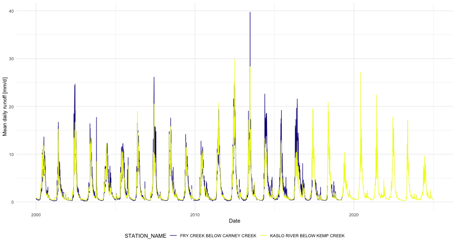

## Package loading
In addition to tidyhydat, this vignette makes use of the [dplyr](https://dplyr.tidyverse.org/) package for data manipulations and [ggplot2](https://ggplot2.tidyverse.org/) for plotting.

```r
library(tidyhydat)
library(dplyr)
library(ggplot2)
```

# `tidyhydat` package
This vignette will outline a few key options that will hopefully make `tidyhydat` useful.  

## HYDAT download
To use many of the functions in the `tidyhydat` package you will need to download a version of the HYDAT database, Environment and Climate Change Canada's database of historical hydrometric data then tell R where to find the database. Conveniently `tidyhydat` does all this for you via:

```r
download_hydat()
```
This downloads the most recent version of HYDAT and then saves it in a location on your computer where `tidyhydat`'s function will look for it. Do be patient though as this takes a long time! To see where HYDAT was saved you can run `hy_dir()`. Now that you have HYDAT downloaded and ready to go, you are all set to begin some hydrologic analysis.
  
## Usage
Most functions in `tidyhydat` follow a common argument structure. We will use the `hy_daily_flows()` function for the following examples though the same approach applies to most functions in the package (See `ls("package:tidyhydat")` for a list of exported objects). Much of the functionality of `tidyhydat` originates with the choice of hydrometric stations that you are interested in. A user will often find themselves creating vectors of station numbers. There are several ways to do this. 

The simplest case is if you would like to extract only station. You can supply this directly to the `station_number` argument:

```r
hy_daily_flows(station_number = "08LA001")
```

```
##   Queried from version of HYDAT released on 2023-11-20
##    Observations:                      31,351
##    Measurement flags:                 6,166
##    Parameter(s):                      Flow
##    Date range:                        1914-01-01 to 2021-12-31 
##    Station(s) returned:               1
##    Stations requested but not returned: 
##     All stations returned.
## # A tibble: 31,351 × 5
##    STATION_NUMBER Date       Parameter Value Symbol
##    <chr>          <date>     <chr>     <dbl> <chr> 
##  1 08LA001        1914-01-01 Flow        144 <NA>  
##  2 08LA001        1914-01-02 Flow        144 <NA>  
##  3 08LA001        1914-01-03 Flow        144 <NA>  
##  4 08LA001        1914-01-04 Flow        140 <NA>  
##  5 08LA001        1914-01-05 Flow        140 <NA>  
##  6 08LA001        1914-01-06 Flow        136 <NA>  
##  7 08LA001        1914-01-07 Flow        136 <NA>  
##  8 08LA001        1914-01-08 Flow        140 <NA>  
##  9 08LA001        1914-01-09 Flow        140 <NA>  
## 10 08LA001        1914-01-10 Flow        140 <NA>  
## # ℹ 31,341 more rows
```

Another method is to use `hy_stations()` to generate your vector which is then given the `station_number` argument. For example, we could take a subset for only those active stations within Prince Edward Island (Province code:PE) and then create vector for `hy_daily_flows()`:


```r
PEI_stns <- hy_stations() %>%
  filter(HYD_STATUS == "ACTIVE") %>%
  filter(PROV_TERR_STATE_LOC == "PE") %>%
  pull_station_number()

PEI_stns
```

```
## [1] "01CA003" "01CB002" "01CB004" "01CB018" "01CC002"
## [6] "01CC005" "01CC010" "01CC011" "01CD005"
```

```r
hy_daily_flows(station_number = PEI_stns)
```

```
##   Queried from version of HYDAT released on 2023-11-20
##    Observations:                      117,530
##    Measurement flags:                 20,867
##    Parameter(s):                      Flow
##    Date range:                        1961-08-01 to 2021-12-31 
##    Station(s) returned:               9
##    Stations requested but not returned: 
##     All stations returned.
## # A tibble: 117,530 × 5
##    STATION_NUMBER Date       Parameter Value Symbol
##    <chr>          <date>     <chr>     <dbl> <chr> 
##  1 01CA003        1961-08-01 Flow         NA <NA>  
##  2 01CB002        1961-08-01 Flow         NA <NA>  
##  3 01CA003        1961-08-02 Flow         NA <NA>  
##  4 01CB002        1961-08-02 Flow         NA <NA>  
##  5 01CA003        1961-08-03 Flow         NA <NA>  
##  6 01CB002        1961-08-03 Flow         NA <NA>  
##  7 01CA003        1961-08-04 Flow         NA <NA>  
##  8 01CB002        1961-08-04 Flow         NA <NA>  
##  9 01CA003        1961-08-05 Flow         NA <NA>  
## 10 01CB002        1961-08-05 Flow         NA <NA>  
## # ℹ 117,520 more rows
```

We can also merge our station choice and data extraction into one unified pipe which accomplishes a single goal. For example if for some reason we wanted all the stations in Canada that had the name "Canada" in them we unify that selection and data extraction process into a single pipe:

```r
search_stn_name("canada") %>%
  pull_station_number() %>%
  hy_daily_flows()
```

```
##   Queried from version of HYDAT released on 2023-11-20
##    Observations:                      87,669
##    Measurement flags:                 26,754
##    Parameter(s):                      Flow
##    Date range:                        1918-08-01 to 2023-05-31 
##    Station(s) returned:               7
##    Stations requested but not returned: 
##     All stations returned.
## # A tibble: 87,669 × 5
##    STATION_NUMBER Date       Parameter Value Symbol
##    <chr>          <date>     <chr>     <dbl> <chr> 
##  1 01AK001        1918-08-01 Flow      NA    <NA>  
##  2 01AK001        1918-08-02 Flow      NA    <NA>  
##  3 01AK001        1918-08-03 Flow      NA    <NA>  
##  4 01AK001        1918-08-04 Flow      NA    <NA>  
##  5 01AK001        1918-08-05 Flow      NA    <NA>  
##  6 01AK001        1918-08-06 Flow      NA    <NA>  
##  7 01AK001        1918-08-07 Flow       1.78 <NA>  
##  8 01AK001        1918-08-08 Flow       1.78 <NA>  
##  9 01AK001        1918-08-09 Flow       1.5  <NA>  
## 10 01AK001        1918-08-10 Flow       1.78 <NA>  
## # ℹ 87,659 more rows
```

We saw above that if we were only interested in a subset of dates we could use the `start_date` and `end_date` arguments. A date must be supplied to both these arguments in the form of YYYY-MM-DD. If you were interested in all daily flow data from station number "08LA001" for 1981, you would specify all days in 1981 :

```r
hy_daily_flows(station_number = "08LA001", 
               start_date = "1981-01-01", 
               end_date = "1981-12-31")
```

This generally outlines the usage of the HYDAT functions within `tidyhydat`. 

## Real-time functions
In addition to the approved and vetted data in the HYDAT database ECCC also offers unapproved data that is subject to revision. `tidyhydat` provides three functions to access these data sources. Remember these are **unapproved** data and should treated as such:

- `realtime_stations()`
- `realtime_dd()`

Not every stations is currently part of the real-time network. Therefore `realtime_stations()` points to a (hopefully) updated ECCC data file of active real-time stations. We can use the `realtime_stations()` functionality to get a vector of stations by jurisdiction. For example, we can choose all the stations in Prince Edward Island using the following:

```r
realtime_stations(prov_terr_state_loc = "PE")
```

`hy_stations()` and `realtime_stations()` perform similar tasks albeit on different data sources. `hy_stations()` extracts directly from HYDAT. In addition to real-time stations, `hy_stations()` outputs discontinued and non-real-time stations:

```r
hy_stations(prov_terr_state_loc = "PE")
```

This is contrast to `realtime_stations()` which downloads all real-time stations. Though this is not always the case, it is best to use `realtime_stations()` when dealing with real-time data and `hy_stations()` when interacting with HYDAT. It is also appropriate to filter the output of `hy_stations()` by the `REAL_TIME` column.   

### Meterological Service of Canada datamart - `realtime_dd()`
To download real-time data using the datamart we can use approximately the same conventions discussed above. Using `realtime_dd()` we can easily select specific stations by supplying a station of interest:

```r
realtime_dd(station_number = "08LG006")
```
Another option is to provide simply the province as an argument and download all stations from that province:

```r
realtime_dd(prov_terr_state_loc = "PE")
```

## Search functions
You can also make use of auxiliary functions in `tidyhydat` called `search_stn_name()` and `search_stn_number()` to look for matches when you know part of a name of a station. For example:

```r
search_stn_name("liard")
```

```
## # A tibble: 9 × 5
##   STATION_NUMBER STATION_NAME   PROV_TERR_STATE_LOC LATITUDE
##   <chr>          <chr>          <chr>                  <dbl>
## 1 10AA001        LIARD RIVER A… YT                      60.1
## 2 10AA006        LIARD RIVER B… YT                      60.8
## 3 10BE001        LIARD RIVER A… BC                      59.4
## 4 10ED001        LIARD RIVER A… NT                      60.2
## 5 10ED002        LIARD RIVER N… NT                      61.7
## 6 10BE005        LIARD RIVER A… BC                      59.7
## 7 10BE006        LIARD RIVER A… BC                      59.7
## 8 10ED008        LIARD RIVER A… NT                      61.1
## 9 10GC004        MACKENZIE RIV… NT                      61.9
## # ℹ 1 more variable: LONGITUDE <dbl>
```
Similarly, `search_stn_number()` can be useful if you are interested in all stations from the *08MF* sub-sub-drainage:

```r
search_stn_number("08MF")
```

```
## # A tibble: 54 × 5
##    STATION_NUMBER STATION_NAME  PROV_TERR_STATE_LOC LATITUDE
##    <chr>          <chr>         <chr>                  <dbl>
##  1 08MF005        FRASER RIVER… BC                      49.4
##  2 08MF040        FRASER RIVER… BC                      50.6
##  3 08MF062        COQUIHALLA R… BC                      49.5
##  4 08MF065        NAHATLATCH R… BC                      50.0
##  5 08MF068        COQUIHALLA R… BC                      49.4
##  6 08MF075        FRASER RIVER… BC                      49.2
##  7 08MF001        ANDERSON RIV… BC                      49.8
##  8 08MF002        BOULDER CREE… BC                      49.3
##  9 08MF003        COQUIHALLA R… BC                      49.4
## 10 08MF004        FRASER RIVER… BC                      50.2
## # ℹ 44 more rows
## # ℹ 1 more variable: LONGITUDE <dbl>
```

## Using joins 
Sometimes it is required to make use of information from two tables from HYDAT. In some cases, we need to combine the information into one table using a common column. Here we will illustrate calculating runoff by combining the `hy_stations` tables with the `hy_daily_flows` table by the `STATION_NUMBER` column:

```r
stns <- c("08NH130", "08NH005")
runoff_data <- hy_daily_flows(station_number = stns, start_date = "2000-01-01") %>%
  left_join(
    hy_stations(station_number = stns) %>%
      select(STATION_NUMBER, STATION_NAME, DRAINAGE_AREA_GROSS),
    by = "STATION_NUMBER") %>%
  ## conversion to mm/d
  mutate(runoff = Value / DRAINAGE_AREA_GROSS * 86400 / 1e6 * 1e3) 


ggplot(runoff_data) + 
  geom_line(aes(x = Date, y = runoff, colour = STATION_NAME)) +
  labs(y = "Mean daily runoff [mm/d]") +
  scale_colour_viridis_d(option = "C") +
  theme_minimal() +
  theme(legend.position = "bottom")
```


This is an effective way to make use of the variety of tables available in HYDAT.

# License

    Copyright 2017 Province of British Columbia

    Licensed under the Apache License, Version 2.0 (the "License");
    you may not use this file except in compliance with the License.
    You may obtain a copy of the License at 

       http://www.apache.org/licenses/LICENSE-2.0

    Unless required by applicable law or agreed to in writing, software
    distributed under the License is distributed on an "AS IS" BASIS,
    WITHOUT WARRANTIES OR CONDITIONS OF ANY KIND, either express or implied.
    See the License for the specific language governing permissions and
    limitations under the License.
