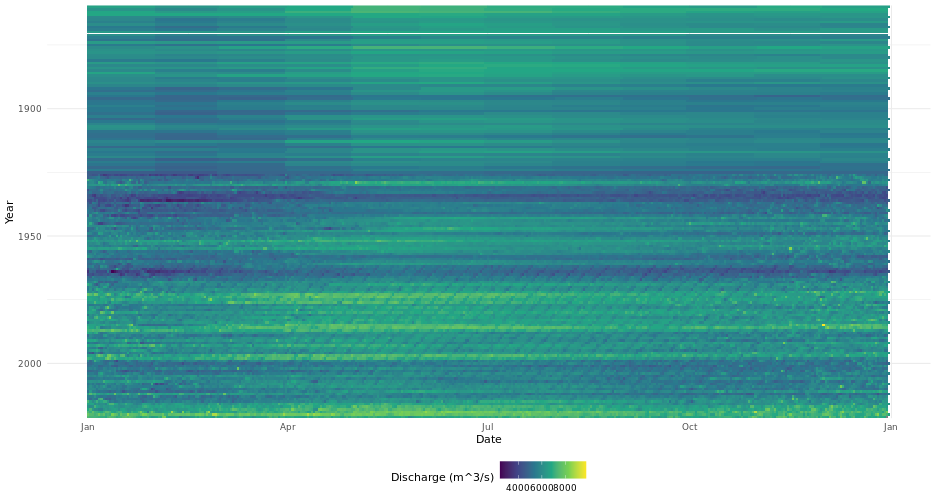
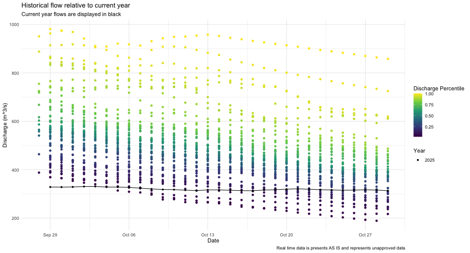

# Introduction

The real power of `tidyhydat` comes with its ability to efficiently import hydrometric data into R which then can be used in conjunction with R's vast array of packages; `tidyhydat` gets hydrometric data into R and allows the user to start conducting data analysis as quickly as possible. This vignette is designed to take a user through two short examples of importing data using `tidyhydat` for use in hydrological visualization and analysis and will therefore use additional tools beyond simply the functions in `tidyhydat`. 

## Familiarity with the tidyverse
`tidyhydat` is designed to exist as a "tidy tool" that is complementary to the [tidyverse](https://CRAN.R-project.org/package=tidyverse) suite of packages. This vignette assumes some familiarity with basic tidy tools particularly `dplyr`, `tidyr`, `ggplot2` and `lubridate`. The [R for Data Science](https://r4ds.had.co.nz/) book by Garrett Grolemund and Hadley Wickham is an enormously useful book both for general R use and for `tidyhydat`. The following is a list of useful links to begin learning particular aspect of each `tidyverse` package:

 - `dplyr`: https://dplyr.tidyverse.org/
 - `tidyr`: https://tidyr.tidyverse.org/
 - `ggplot2`: https://ggplot2.tidyverse.org/
 - `lubridate`: https://lubridate.tidyverse.org/

# Example 1: Basic Data Extraction and Plotting

In this section, we will be using `dplyr`, a data manipulation package, `ggplot2`, an extremely simple yet powerful data visualization tool, `lubridate` a package that aids significantly in working with date and times in R and of course `tidyhydat`. Take a deep breathe. Though this might seem like an overwhelming onslaught of information on packages, each of these packages will save you considerable time with relatively minimal learning investment.

```r
library(tidyhydat)
library(dplyr)
library(ggplot2)
library(lubridate)
```

## Objective
Use `tidyhydat` to find the longest flow record in the Canadian hydrometric network then illustrate the use and ease of `ggplot2` to create some visualizations of the discharge data. 

Your first step is to download the HYDAT database which `tidyhydat` facilitates for you:

```r
download_hydat()
```
You can see where the database was downloaded by running `hy_dir()`. This should be the only instance where you will need to interact directly with HYDAT. Each `tidyhydat` function prefixed with `hy` will automatically know where to look for HYDAT saving you the trouble. When using `tidyhydat`, often your first task is to find the station(s) that you are interested in. Because we are interested in the longest record we can extract that information with `hy_stn_data_range()` and then feed that information to `hy_daily_flows()` like this: 


```r
longest_record_data <- hy_stn_data_range() %>%
  filter(DATA_TYPE == "Q", RECORD_LENGTH == max(RECORD_LENGTH)) %>%
  pull_station_number() %>%
  hy_daily_flows()
```
Let's break this down line by line to understand how `tidyhydat` uses tidy tools. First we are interested in getting data on record length:

```r
hy_stn_data_range()
```

```
##   Queried from version of HYDAT released on 2023-11-20
##    Observations:                      12,125
##    Station(s) returned:               7,963
##    Stations requested but not returned: 
##     All stations returned.
## # A tibble: 12,125 × 6
##    STATION_NUMBER DATA_TYPE SED_DATA_TYPE Year_from Year_to
##    <chr>          <chr>     <chr>             <int>   <int>
##  1 01AA002        Q         <NA>               1967    1977
##  2 01AD001        Q         <NA>               1918    1997
##  3 01AD002        Q         <NA>               1926    2021
##  4 01AD003        H         <NA>               2011    2022
##  5 01AD003        Q         <NA>               1951    2022
##  6 01AD004        H         <NA>               1980    2021
##  7 01AD004        Q         <NA>               1968    1979
##  8 01AD005        H         <NA>               1966    1974
##  9 01AD008        H         <NA>               1972    1974
## 10 01AD009        H         <NA>               1973    1982
## # ℹ 12,115 more rows
## # ℹ 1 more variable: RECORD_LENGTH <int>
```
Our objective here is to filter from this data for the station that has the longest record of flow (`DATA_TYPE == "Q"`). You'll also notice this symbol `%>%` which in R is called a [pipe](https://magrittr.tidyverse.org/reference/pipe.html). In code, read it as the word *then*. So for the data_range data we want to grab the data *then* filter it by flow ("Q") in `DATA_TYPE` and then by the maximum value of `RECORD_LENGTH`:

```r
hy_stn_data_range() %>%
  filter(DATA_TYPE == "Q", RECORD_LENGTH == max(RECORD_LENGTH))
```

```
##   Queried from version of HYDAT released on 2023-11-20
##    Observations:                      1
##    Station(s) returned:               1
##    Stations requested but not returned: 
##     All stations returned.
## # A tibble: 1 × 6
##   STATION_NUMBER DATA_TYPE SED_DATA_TYPE Year_from Year_to
##   <chr>          <chr>     <chr>             <int>   <int>
## 1 02HA003        Q         <NA>               1860    2021
## # ℹ 1 more variable: RECORD_LENGTH <int>
```
*then* pull the `STATION_NUMBER` that has the longest record:

```r
hy_stn_data_range() %>%
  filter(DATA_TYPE == "Q", RECORD_LENGTH == max(RECORD_LENGTH)) %>%
  pull_station_number()
```

```
## [1] "02HA003"
```
*then* feed that number to `hy_daily_flows()`

```r
longest_record_data <- hy_stn_data_range() %>%
  filter(DATA_TYPE == "Q", RECORD_LENGTH == max(RECORD_LENGTH)) %>%
  pull_station_number() %>%
  hy_daily_flows()
```

The result of this collection of simple functions is that we've extracted data the entire daily flow dataset (from 1860-2016) from station `02HA003`.If we wanted more information on this station we could query other tables in HYDAT for more information. The `hy_stations()` function is very useful and outputs considerable metadata on a given station (converted here to a list for viewing purposes):

```r
hy_stations(station_number = unique(longest_record_data$STATION_NUMBER)) %>%
  as.list()
```

```
## $STATION_NUMBER
## [1] "02HA003"
## 
## $STATION_NAME
## [1] "NIAGARA RIVER AT QUEENSTON"
## 
## $PROV_TERR_STATE_LOC
## [1] "ON"
## 
## $REGIONAL_OFFICE_ID
## [1] 5
## 
## $HYD_STATUS
## [1] "ACTIVE"
## 
## $SED_STATUS
## [1] NA
## 
## $LATITUDE
## [1] 43.15694
## 
## $LONGITUDE
## [1] -79.04722
## 
## $DRAINAGE_AREA_GROSS
## [1] 686000
## 
## $DRAINAGE_AREA_EFFECT
## [1] NA
## 
## $RHBN
## [1] FALSE
## 
## $REAL_TIME
## [1] FALSE
## 
## $CONTRIBUTOR_ID
## [1] 647
## 
## $OPERATOR_ID
## [1] 337
## 
## $DATUM_ID
## [1] 10
## 
## attr(,"missed_stns")
## character(0)
```


We now know that this station is actually *NIAGARA RIVER AT QUEENSTON* in Ontario and has an upstream drainage basin area of 686,000 square kilometres. As a first step toward visualization, let's simply plot the time series for the entire record with a smoother added:


```r
longest_record_data %>%
  ggplot(aes(x = Date, y = Value)) +
  geom_line(alpha = 0.5) +
  geom_point(size = 0.25) +
  geom_smooth() +
  labs(y = "Discharge (m)") +
  theme_minimal()
```


You can see very clearly where continuous monitoring was established. However, this type of plot obscures much of the data that we are interested in. We could plot all the years on the same axis and separate year by line colour. That requires a little bit of manipulation ahead of plotting using both `dplyr` and `lubridate`. Remember you can run a pipe adding one line at a time and comparing the outputs to get a sense of what each step is doing:


```r
longest_record_data %>%
  mutate(dayofyear = yday(Date), Year = year(Date)) %>%
  mutate(dayofyear_formatted = as.Date(dayofyear - 1, origin = "2016-01-01")) %>% ## leap year as placeholder
  ggplot(aes(x = dayofyear_formatted, y = Value, colour = Year)) +
  geom_line() +
  scale_x_date(date_labels = "%b %d") +
  labs(y = "Discharge (m)") +
  theme_minimal()
```


This still is not a very useful plot mostly because our colour range still doesn't resolve year very well and any intra-annual is not visible with this plot. Consider, for example, if rather than a line plot we use a tile plot and modified our colour scale to include more colours:


```r
longest_record_data %>%
  mutate(dayofyear = yday(Date), Year = year(Date)) %>%
  mutate(dayofyear_formatted = as.Date(dayofyear - 1, origin = "2016-01-01")) %>% 
  ggplot(aes(x = dayofyear_formatted, y = Year, fill = Value)) +
  geom_tile() +
  scale_x_date(date_labels = "%b") +
  scale_y_reverse(expand = c(0, 0)) +
  scale_fill_viridis_c(name = "Discharge (m^3/s)") +
  labs(y = "Year", x = "Date") +
  theme_minimal() +
  theme(legend.position="bottom")
```


This type of plot provides a clear indicator of discharge patterns over time. Our analysis ends here but one can imagine drawing in climate indices and variation to help explain periods of extreme discharge. 

# Example 2: Distribution of Historical Data
## Objective
Evaluate current conditions in the station from Nunavut with longest record that is also in the Reference Hydrometric Basin Network relative to historical values.

For our second example, we will illustrate how to calculate a common metric used in hydrology: percentiles. For this approach we will use another piped series of functions to zero in on the station that we want. The packages we need for this example are loaded first:


```r
library(tidyhydat)
library(dplyr)
library(ggplot2)
library(lubridate)
```

The pipe below finds the active station that has realtime data in the [Reference Hydrometric Basin Network](https://www.canada.ca/en/environment-climate-change/services/water-overview/quantity/monitoring/survey/data-products-services/reference-hydrometric-basin-network.html) (RHBN) in the territory of Nunavut that has the longest record then grabs all the daily flow information:
  

```r
nunavut_stn_flows <- hy_stations() %>%
  filter(HYD_STATUS == "ACTIVE") %>%
  filter(REAL_TIME == TRUE) %>%
  filter(RHBN == TRUE) %>%
  filter(PROV_TERR_STATE_LOC == "NU") %>%
  pull_station_number() %>%
  hy_stn_data_range() %>%
  filter(DATA_TYPE == "Q") %>% 
  filter(RECORD_LENGTH == max(RECORD_LENGTH)) %>%
  pull_station_number() %>%
  hy_daily_flows()
```

We can now evaluate the historical distribution of data collection to put some real time data into historical context. First we need to calculate where an individual observation is distributed against all other observations on that day for every day. The `prctile` column tells us what percentage of values on that same day over the entire data record fall above and below the observations on that row. We are restricting our analysis to the last thirty days from when this vignette was last compiled. The `ecdf()` function creates an equation to calculate percentiles based on the `Value` column (i.e discharge) then takes each individual observation of `Value` and calculates the percentile. 

```r
pct_flow <- nunavut_stn_flows %>%
  mutate(dayofyear = yday(Date), Year = year(Date)) %>%
  filter(dayofyear %in% yday(seq.Date(from = (Sys.Date()-30), 
                                      to = Sys.Date(), by = "day"))) %>%
  group_by(dayofyear) %>%
  mutate(prctile = ecdf(Value)(Value)) %>%
  mutate(Date_no_year = dmy(paste0(day(Date),"-",month(Date),"-",year(Sys.Date())))) %>%
  ungroup()
```

To collect real time data, we can use the `realtime_dd()` function in `tidyhydat`. Because real time data is collected in hourly (or higher) intervals and we are operating on a daily basis, we first need to take a daily mean of discharge. Again this is accomplished in a pipe:


```r
nunavut_realtime <- realtime_dd(unique(nunavut_stn_flows$STATION_NUMBER)) %>%
     mutate(Date_day = as.Date(Date)) %>%
     group_by(Date_day) %>%
     summarise(Value = mean(Value, na.rm = TRUE), .groups = "drop") 
```

Finally we can plot all of this on to one figure. This type of plot is useful to combine historical data sources with real time data and provide a visual assessment of how typical flows in a given system are. 


```r
ggplot(pct_flow, aes(x = Date_no_year, y = Value)) +
  geom_point(aes(colour = prctile)) +
  geom_line(data = nunavut_realtime, aes(x = Date_day), colour = "black") +
  geom_point(data = nunavut_realtime, aes(x = Date_day, shape = factor(year(Date_day))), colour = "black") +
  scale_colour_viridis_c(name = "Discharge Percentile") +
  scale_shape_discrete(name = "Year") +
  theme_minimal() +
  labs(title = "Historical flow relative to current year",
       subtitle = "Current year flows are displayed in black",
       caption = "Real time data is presents AS IS and represents unapproved data",
       x = "Date", y = "Discharge (m^3/s)")
```


**CAUTION**: All real time data are presented AS IS and represents unapproved data.
